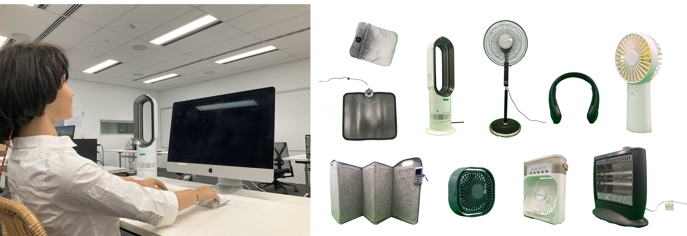

# PCS Database



This repository is for a database of PCS (Personal Comfort System) such as a desk fan and foot warmer.
Each PCS cooling/heating effects on the human body was quantified using a thermal manikin in a climate controlled chamber
at the IEQLab of The University of Sydney.

The repository contains the data and the related code to generate database as the following file structure.
Please note that all the image files are not stored in this repository due to the limited storage of this repository,
but you can access them at [here](https://unisyd-my.sharepoint.com/:f:/r/personal/akihisa_nomoto_sydney_edu_au/Documents/PCS%20Database?csf=1&web=1&e=QgKj7a) upon request.

    ```
    ├── code # Python code to generate the database
    ├── data
        ├── raw_data # Output results from the thermal manikin
        ├── processed_data # Processed data by the code
        ├── PCS_Database.csv # Database
        └── metadata.json # For detailed descriptions
    ├── figure # For generated figures
    ├── image # For images of experiment/each PCS
    ├── manuscript
    ├── presentation
    ├── reference
    └── out
    ``

<!-- METADATA_START -->

# Database Metadata

Schema Description (Generated on 2025-09-03 12:27:42)

| Parameter                        | Type      | Description                                                                                                                                     | Example                        |
| -------------------------------- | --------- | ----------------------------------------------------------------------------------------------------------------------------------------------- | ------------------------------ |
| **`PCS_ID`**                     | _integer_ | Unique PCS identifier (integer number)                                                                                                          | 1                              |
| **`PCS_Name`**                   | _string_  | Unique PCS descriptor identifier                                                                                                                | Desk Fan_Dyson                 |
| **`Category`**                   | _string_  | Category of the PCS. Must be one of:`Cooling, Heating`.                                                                                         | Cooling                        |
| **`Physical_Effect`**            | _string_  | Physical effect of the PCS. Must be one or more: Convective, Conductive, Radiant, Evaporative.                                                  | Convective                     |
| **`Type`**                       | _string_  | Type of PCS (e.g., fan, foot warmer).                                                                                                           | Small desk fan                 |
| **`Size`**                       | _number_  | PCS dimensions in the following format: height, length, width (cm)                                                                              | 20, 20, 3                      |
| **`Brand`**                      | _string_  | Brand name of the PCS. If it is a prototype, give it a name.                                                                                    | Simpeak                        |
| **`Product_Reference`**          | _string_  | Reference product URL or project landing page.                                                                                                  | http://...                     |
| **`Availability`**               | _string_  | Market availability. Must be one of:`Market-ready, Prototype`.                                                                                  | Market-ready                   |
| **`Image`**                      | _string_  | Name of the image file of the PCS in JPEG or PNG format (preference for high resolution 300dpi)                                                 | example.jpg                    |
| **`Publication`**                | _string_  | DOI or URL for a publication where this data is presented.                                                                                      | 10.53540/tjer.vol18iss2pp62-71 |
| **`PCS_Level`**                  | _string_  | Selected level for the test/total PEC control available levels. Example, for a fan with 10 speed levels, level 3 is selected: 3/10.             | Low                            |
| **`Price_USD`**                  | _number_  | Price of the PCS in US dollars.                                                                                                                 | 10                             |
| **`Year`**                       | _number_  | Year of the study                                                                                                                               | 10                             |
| **`Angle_Horizontal`**           | _number_  | Horizontal angle between the middle of PCS and the middle of target body part (degrees).                                                        | 125.0                          |
| **`Distance_Horizontal`**        | _number_  | Horizontal distance between the middle of the PCS and target body part (cm).                                                                    | 60.0                           |
| **`Distance_Vertical`**          | _number_  | Vertical distance between the middle of the PCS and target body part (cm).                                                                      | 10.0                           |
| **`Target_Body`**                | _string_  | Body Segment targeted by PCS.                                                                                                                   | Face                           |
| **`Plug_Power`**                 | _number_  | Power supply of the PCS (W).                                                                                                                    | 10                             |
| **`Research_Center`**            | _string_  | Facility where the measurement was taken.                                                                                                       | The University of Sydney       |
| **`Country`**                    | _string_  | Country where the study was performed.                                                                                                          | Australia                      |
| **`Posture`**                    | _string_  | Posture of the manikin during measurement (e.g., standing, sitting).                                                                            | Sitting                        |
| **`Context`**                    | _string_  | Type of building or vehicle considered in the experiment (e.g., office, car).                                                                   | Office                         |
| **`Manikin_Company`**            | _string_  | Manufacturer of the thermal manikin used.                                                                                                       | PT Manikins                    |
| **`Manikin_Type`**               | _string_  | Manikin capability. Non-wired manikins should not be included. Must be one of:`Thermal, Sweating`.                                              | Thermal                        |
| **`Manikin_Gender`**             | _string_  | Gender representation of the thermal manikin. Must be one of:`Male, Female`.                                                                    | Female                         |
| **`Manikin_Body_Segments`**      | _integer_ | Number of body segments of the thermal manikin.                                                                                                 | 22                             |
| **`Control_Method`**             | _string_  | Method used to control the PCS (e.g., manual, automatic). Must be one of:`TskControl, HeatFluxControl, ComfortControl`.                         | TskControl                     |
| **`{Condition}_Ta`**             | _number_  | Ambient air temperature (°C).                                                                                                                   | 25                             |
| **`{Condition}_MRT`**            | _number_  | Mean radiant temperature (°C).                                                                                                                  | 25                             |
| **`{Condition}_RH`**             | _number_  | Relative humidity (%).                                                                                                                          | 50                             |
| **`{Condition}_V`**              | _number_  | Air velocity (m/s). Body part information follows this parameter. See:`#/definitions/Condition`                                                 | 0.1                            |
| **`{Condition}_Tsk_{BodyPart}`** | _number_  | Skin temperature for each body part(°C). Body part information follows this parameter. See:`#/definitions/Condition and #/definitions/BodyPart` | 34                             |
| **`{Condition}_P_{BodyPart}`**   | _number_  | Power supply for each body part (W). Body part information follows this parameter. See:`#/definitions/Condition and #/definitions/BodyPart`     | 100                            |
| **`Delta_Teq_{BodyPart}`**       | _number_  | Change in equivalent temperature for each body part (°C). Body part information follows this parameter. See:`#/definitions/BodyPart`            | 1                              |
| **`Delta_P_{BodyPart}`**         | _number_  | Change in power supply from the manikin for each body part (W). Body part information follows this parameter. See:`#/definitions/BodyPart`      | 10                             |
| **`Clo_{BodyPart}`**             | _number_  | Clothing insulation for each body part. Body part information follows this parameter. See:`#/definitions/BodyPart`                              | 1                              |
| **`Condition_without_PCS`**      | _string_  | File path to the raw data without PCS.                                                                                                          | ID0_NoPCS.csv                  |
| **`Condition_with_PCS`**         | _string_  | File path to the raw data with PCS.                                                                                                             | ID1_Small desk fan (grey).csv  |

## Definitions

- **`BodyPart`** _(type: object)_ - Properties: `Crown`, `Head`, `Left_Chest`, `Right_Chest`, `Left_Back`, `Right_Back`, `Abdomen`, `Buttocks`, `Left_Upper_Arm`, `Right_Upper_Arm`, `Left_Forearm`, `Right_Forearm`, `Left_Hand`, `Right_Hand`, `Left_Front_Thigh`, `Right_Front_Thigh`, `Left_Back_Thigh`, `Right_Back_Thigh`, `Left_Lower_Leg`, `Right_Lower_Leg`, `Left_Foot`, `Right_Foot`
- **`Condition`** _(type: object)_ - Properties: `Baseline`, `PCS`

<!-- METADATA_END -->

# Contribution

We welcome contributions to this database from external participats.

## General Rules

- Casing: Please use [snake case](https://en.wikipedia.org/wiki/Snake_case) for your code and file names.

## Data Sharing Policy

The data in this repository is shared under the following conditions:

1. **Who the data are shared with**:This repository is public, giving access to general public.
2. **Where the data are stored**:The data are stored in this GitHub repository managed by [IEQ Lab at The University of Sydney](https://www.sydney.edu.au/architecture/our-research/research-labs-and-facilities/indoor-environmental-quality-lab.html).
3. **Where the data will be published**:
   The data will be published in journal/conference papers and integrated into a web application hosted by UC Berkeley: [https://abc.cbe.berkeley.edu/](https://abc.cbe.berkeley.edu/).

⚠️ **Please do not include any personal or sensitive information (e.g., subject names, email addresses) in this repository. All data must be properly anonymized before sharing.**

# Contact

If you have any questions or requests regarding the PCS database, please contact:

- **Akihisa Nomoto** (monyo323232@gmail.com)
- **Maira Andre** (maira.andre@sydney.edu.au)

# Other Information

There is [an example PCS database](data/pcs_database_example.csv)
