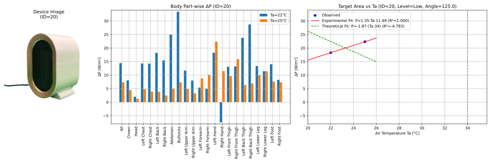

# 📄 Data Analysis Report
**Date:** 2025-08-04  
**Author:** Aki

---

## 1. Overview
This report summarizes the latest progress and findings from this project.

---

## Data Analysis
### Data Preparation
The dataset used for this analysis is the August dataset, which contains measurements of various personal comfort 
systems

### Data Visualization
#### PCS's heating/cooling impact to the whole body
* Low, Mid, and High PCS settings were shown.
* 

*Figure 1. Average temperature trend for August dataset.*

---
